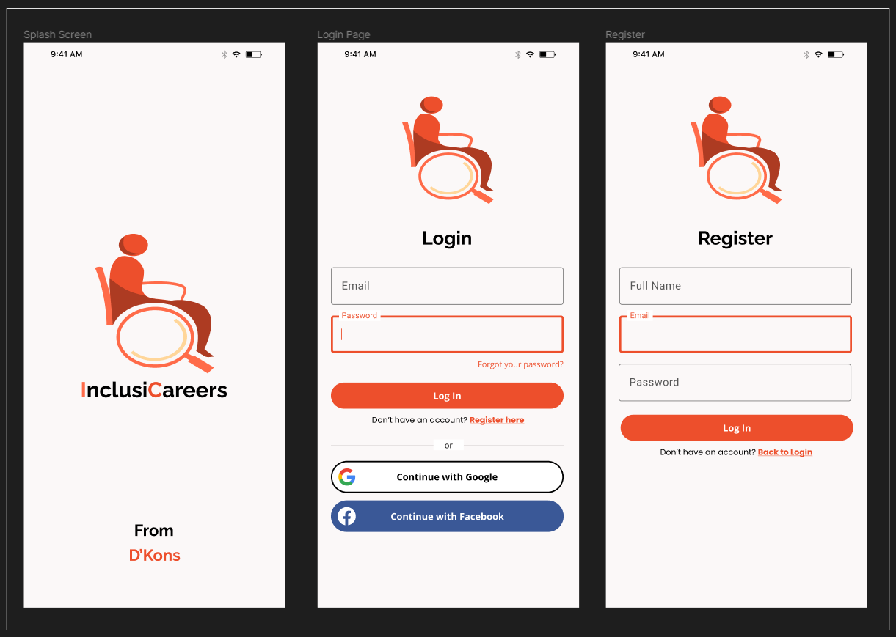
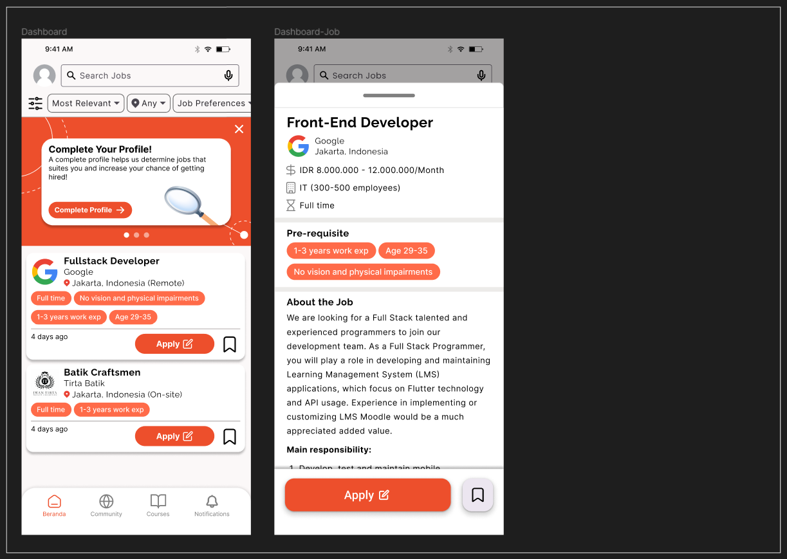
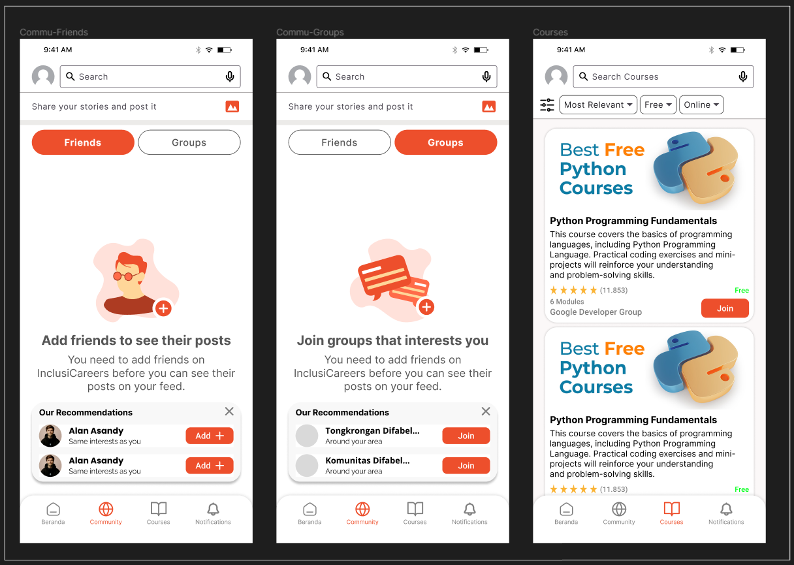

# InclusiCareers - Client

## Introduction

Our idea for this project came from a critical question: What should the future of AI look like? Should AI's focus be limited to improving job efficiency, or is it possible to picture a time when it embraces inclusivity and equality for all? We strongly favor the latter. Only 2 out of 5 people with disabilities are employed in Indonesia, which raises concerns because their jobs may not even be adequate or equitable for them. We were inspired to develop a solution that makes use of AI's capabilities to level the playing field by this blatant imbalance and discrimination. Our project closely reflects objectives 8 and 10 of the Sustainable Development Goals (SDGs) set forth by the United Nations. While SDG 10 is concerned with eliminating inequality, SDG 8 focuses on promoting decent work and economic prosperity. We are also motivated to embrace Environmental, Social, and Governance (ESG) viewpoints, promote diversity and accessibility using AI, and provide for a range of disabilities. Additionally, our aim is motivated by Indonesia's current goal to combat unemployment and advance equality. We are driven by the belief that AI should be a force for positive change, creating a future where inclusivity and equality are not just dreams but a reality for all.
InclusiCareers is an innovative application aimed at providing equal opportunities for people with disabilities in the job market, empowering them to adapt to AI-driven work cultures. We believe that the future of AI lies in creating broad and fair opportunities for all individuals across various fields. InclusiCareers will be developed as a mobile app, catering to a diverse user base and ensuring accessibility for everyone.

## About This Project

This project is still on progress

### Tech Stack

- Front-End :
  - Flutter
- Back-End (https://github.com/arieljovananda88/inclusicareers-server):
  - Go
  - Postgresql

### Prototype

You can access our mobile app design [here](https://www.figma.com/file/yqaEefJhL6bFiZHuc7IvJW/Inclusi-Careers?type=design&node-id=5%3A2358&mode=design&t=JnvtuZ2cNJ1TuJ6D-1)

- Splash Screen, Login & Register
  

- Search Jobs
  

- Community & Courses
  

## Contributors

| Name                    | Role    | Email                       |
| ----------------------- | ------- | --------------------------- |
| Mohammad Farhan Fahrezy | Hacker  | mohdfarhanfahrezy@gmail.com |
| Ariel Jovananda         | Hacker  | arieljovananda@gmail.com    |
| Raka Admiharfan Fatihah | Hustler | rakaadmiharfan@gmail.com    |
| Akmal Natha Abhirama    | Hipster | akmalabhirama2002@gmail.com |
